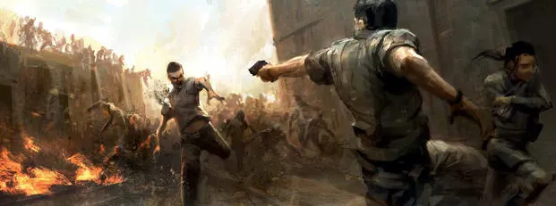
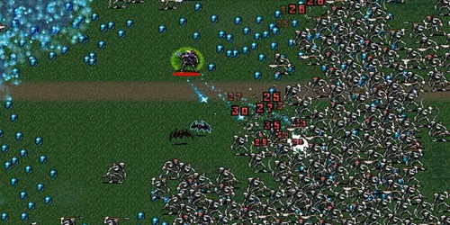
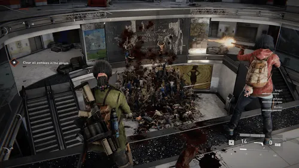

# SupeRun

**How long will you last?**

## מהות המשחק

The game will revolve around a relativly short game loop (30 mins for a usual good run ). where you will have a random map(relatively random) and a increasing horde of mobs trying to kill you, and you will need to kill them efficiently to gain xp and coins which will allow you go grow stronger and stay with the difficulty curve. The run ends when the player dies or after he finished certain objectives and desires to end the run. each run will reward the player with "static/global" coins which will be a currency the will allow the player to buy upgrades for future runs. The emphesis in this game will be: 
1. various weapons and upgrades allowing the player to deal with the horde in fun ways
2. fun and challenging momvement that will allow a good player to use it to his advantage(low skill cieling)
3. shooting which will reward skilled aiming and has a fun/rewarding feel(but it wont be necesary to be able to get a good run, shooting good will decide if you are very good or very very good)
4. The player reaching a point where he has a lot of enemies piling up chasing after him while he kites and kills them.
5. eventually the horde will become too powerfull for even the best run and will kill the player but that will happen after a long time
6. the challenge for dedicated player will propably be pushing that end point further and futrther back as they can trying to get a better run each time.
7. 6 will be achieved using a leaderboard that will reset each week or so and will showcase to everyone who got that furthest and how much kills they got.
   
The game will be developed for pc and is 3D.

### 1. שחקנים

* The game is designed for people who want to have a fun and fullfilling gaming expirience in a span of an hour or 30 mins.
* SinglePlayer

### 2. יעדים

* To just win you will need to survive around 30 mins and ccomplish some objectives on the way.
* The player will be informed about his objectives using an initial tutorial run and objective markers. 

### 3. תהליכים

* The first 30 seconds will revolve around looking at your surrounding for special chests or other "buff collectibles" and starting to gain some expirience and money by killing some mobs and getting upgrades that are random.
*	The core loop revolves around the player killing mobs to get random(choose 1 of 3 ) upgrades to make himself better at killing mobs so he can survive longer.The player will try to get items that will synergise and be more efficient then other items for his build.
*	In general it will be a third person camera over a charachter you will choose, each charachter will have a specific starting weapon(guarenteeing you will have this weapon for the run). he will be able to find more weapons and general upgrades throughout the run.
*	If the player survived for 30 mins and beat a final boos, then he will have the option to end the run or to try to reach a high score with his build. If the player chooses to continue he will then continue  with an endless horde and try to push to get a high score and get on the leaderboard.

using a begginers tutorial run we will teach the player the important point of our game which you will be able to replay. 

### 4. חוקים

* If the player recieves too much dmg he will lose the run.
* The player decision will be powered by his gold economy deciding wether he can purchase an item or reroll for a different item.
The game rules will be explained to the player

### 5. משאבים

* Gold, Exp, Gems
* Gold and Exp are run specific resource and reset each new run. Gems are a resource you recieve after each run based on your performance and is used for unlocking new items and charachters.
* Gems will be rare because they are based on how much the player played the game.
* The player will have counter indicating how much of each resource he has.

### 6. עימותים

* The main conflict in the game will be finding the best combination of items, being able to hit enemy weak points, hit as many enemies as possible with each shot and being able to dodge and "train" the enemy horde 
  

### 7. גבולות
*The world will be a randomely generated "arena" with clear boundries, it will have interest points (15 points each run, each randomly chosen) that will give the player upgrades. A begginer player will be able to move at an ok speed but a player who will use the movement mechanics well will be able to traverse the level at good speeds consisteny and thus visit all the interest points. he will also have a map to point him to carious interest points.

### 8. תוצאות
*The game has 2 outcomes, you die or you end the run.
*It will be very luck based but a skilled player will be able to get much further then someone unskilled even if one has a better build.
---

## סקירת משחקים קיימים
VampireSurvivors: similar game in concept with the upgrades and items system but is a 2d game with a run being decided mainly on luck with no skill expression. This game provides a skill level to the game and wil be more engaging.

World War Z: similar in the way that it is a horde shooter but its limited because of its graphics style. This game which will have a less realistic style will be able to handle big number of enemies and be accecible for lesser pc's.

left 4 dead 2: similar zombie horde game but its less arcady, is level based and doesnt have any upgrade systems or ways to kill a really big number of zombies.

In my search i used terms like: zombie game, horde shooter, arcade shooter, endless arena shooter.

The unique part about the game will be trying to manage an increasing horde of mobs, dodging and killing a lot of mobs with cool builds and a fun movement system.

